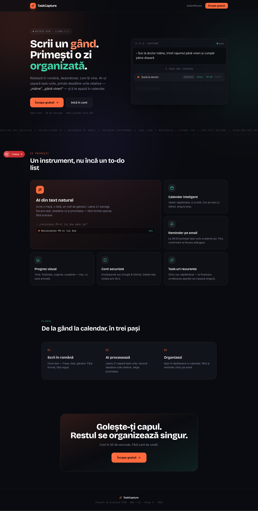
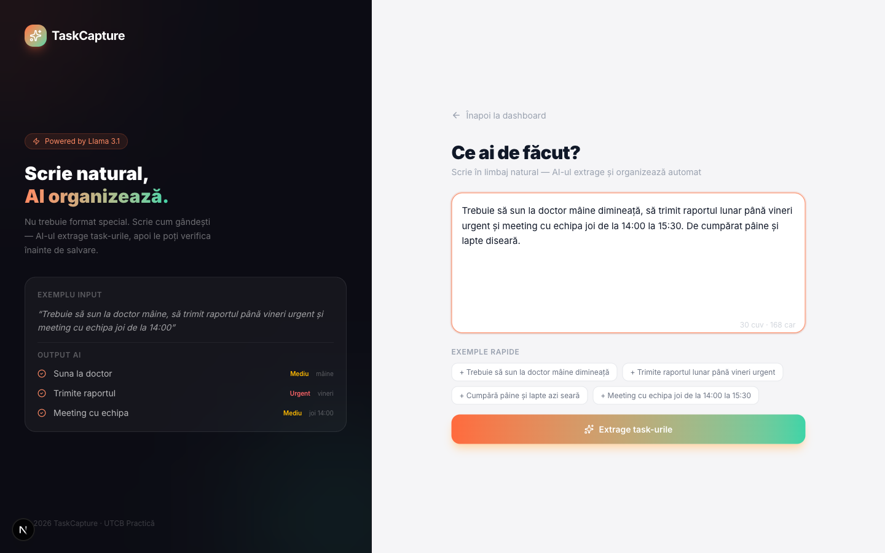
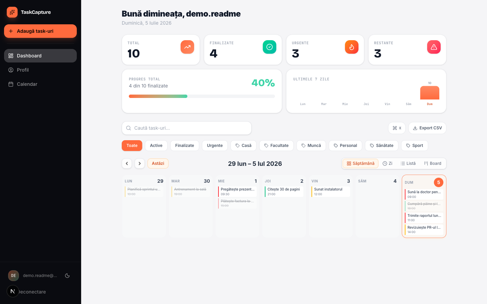
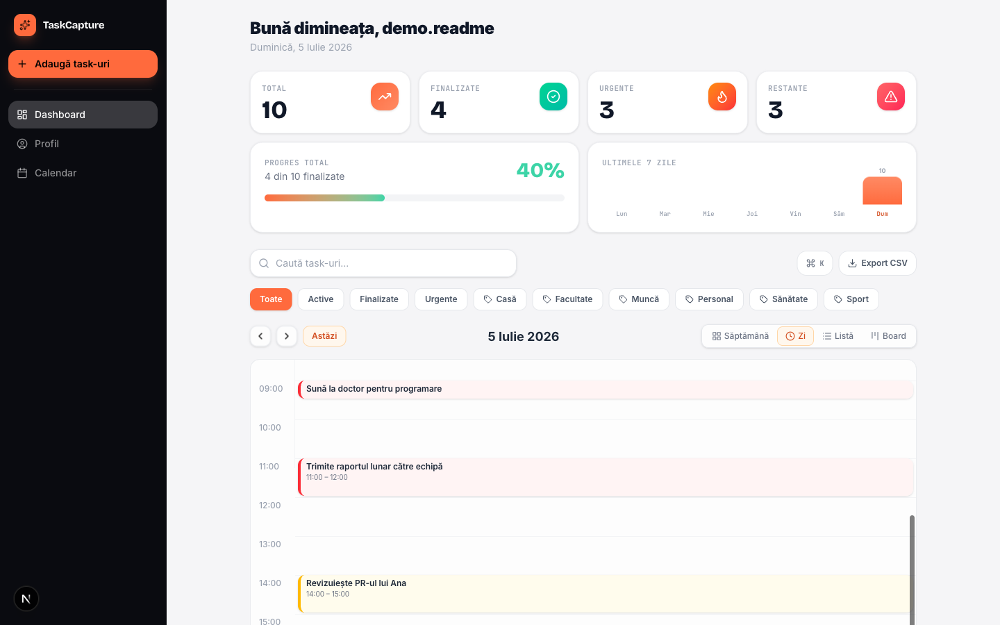
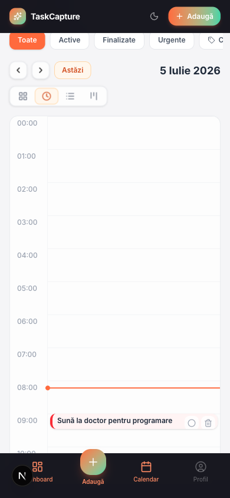

<div align="center">

# 🎯 TaskCapture

**Scrii un gând. Primești o zi organizată.**

Aplicație web care transformă text natural, dezordonat, în task-uri acționabile — cu prioritate, deadline și categorie extrase automat de AI — apoi le așază în calendar și îți trimite remindere pe email.

[](https://www.taskcapture.xyz)
&nbsp;


</div>

---

<div align="center">
  
</div>

## ✨ Ce face

Notezi în română, cum îți vine — *„Trebuie să sun la doctor mâine, să trimit raportul până vineri urgent și să cumpăr pâine diseară”* — iar **Llama 3.1** (prin NVIDIA NIM) separă task-urile, prinde deadline-urile relative („mâine”, „până vineri”), le atribuie prioritate și categorie, și le salvează în dashboard-ul tău. Fără format special, fără butoane.

Nu e încă un to-do list. E instrumentul care golește ce ai în cap și îl organizează singur.

## 🚀 Funcționalități

| | |
|---|---|
| 🧠 **AI din text natural** | Extragere task-uri via NVIDIA NIM (Llama 3.1), cu deadline-uri relative rezolvate în fusul tău orar |
| 📅 **Calendar inteligent** | Vederi săptămână / zi (timeline 00–24h) / listă / board Kanban, cu drag & drop și ore de start–end |
| 🔔 **Remindere pe email** | Digest zilnic la ora ta locală + reminder per-task („cu 30 min înainte”), plus confirmare la fiecare adăugare/editare |
| 🔁 **Task-uri recurente** | Zilnic sau săptămânal — la finalizare, următoarea apariție se creează singură |
| 🔎 **Căutare & filtre** | După text, status, prioritate, categorie și interval de deadline |
| 📤 **Export** | CSV pentru raport, sau feed **iCalendar (.ics)** abonabil în Google / iOS Calendar |
| 📊 **Progres live** | Total, finalizate, urgente, restante — cu bară animată și activitate pe 7 zile |
| 🔐 **Cont securizat** | Email/parolă + OAuth Google & GitHub; datele izolate prin Row-Level Security |
| ⚡ **⌘K Command Palette** | Navigare și acțiuni rapide din tastatură |

## 🖼️ Capturi

### Input — scrii natural, AI organizează


### Dashboard — vedere pe săptămână


### Vedere pe zi — timeline complet 00:00–23:59


### Responsive pe telefon
<div align="center">
  
</div>

## 🧱 Stack

| Componentă | Tehnologie |
|---|---|
| Framework | Next.js 16 (App Router, TypeScript, Turbopack) |
| UI | Tailwind CSS v4 + shadcn/ui + Framer Motion + dnd-kit |
| Auth + DB | Supabase (PostgreSQL + Row-Level Security, `@supabase/ssr`) |
| AI | NVIDIA NIM — `meta/llama-3.1-8b-instruct` (via `openai` SDK) |
| Validare | Zod v4 |
| Email | Resend — domeniu `taskcapture.xyz` |
| Rate limiting | Upstash Redis (sliding-window, fail-open) |
| Deploy | Vercel + Cron zilnic; Supabase pg_cron orar pentru remindere |

## 🏗️ Cum funcționează

```
Text natural  →  POST /api/parse-tasks  →  NVIDIA NIM (Llama 3.1)
                                              │  (data curentă injectată în prompt
                                              │   pentru deadline-uri relative)
                                              ▼
                    Zod validare  →  buildTaskRow()  →  INSERT în Supabase (RLS)
                                              │
                                              ▼
                    email_new_tasks ? → confirmare pe email (Resend)
```

Reminderele rulează separat: `POST /api/send-reminder` (protejat cu Bearer secret) e apelat **orar** de Supabase pg_cron — calculează pentru fiecare user ora locală și trimite digestul zilnic + reminderele per-task, idempotent.

Detalii de arhitectură (cei trei clienți Supabase, logica notificărilor, constrângerea cron pe Vercel Hobby) sunt în [`CLAUDE.md`](CLAUDE.md) și [`AGENTS.md`](AGENTS.md).

## 📁 Structură

```
src/
├── app/
│   ├── page.tsx              # Landing public
│   ├── login/ register/      # Auth email + OAuth
│   ├── input/                # Input text natural
│   ├── dashboard/            # Dashboard principal (calendar + stats)
│   ├── profile/              # Preferințe (fus orar, remindere, email)
│   ├── admin/                # Panou dev-only (404 în producție)
│   └── api/                  # parse-tasks, tasks(+search/bulk/ics/duplicate),
│                             #   stats, prefs, send-reminder
├── components/               # CalendarView, BoardView, TaskCard/List,
│                             #   modale, CommandPalette, Sidebar, MobileNav
├── lib/
│   ├── llm.ts schemas.ts     # AI + validare Zod (cu teste)
│   ├── stats.ts ics.ts csv.ts# agregări + export (cu teste)
│   ├── resend.ts             # email
│   └── supabase/             # clienți browser / server / admin
└── middleware.ts             # protecție rute
supabase/migrations/          # 001..008 — rulate în ordine în SQL Editor
```

## ⚙️ Setup local

```bash
git clone https://github.com/ed0one/practica_devidevs
cd practica_devidevs
npm install
cp .env.example .env.local     # completează variabilele (vezi mai jos)
npm run dev                    # http://localhost:3000
```

### Variabile de mediu

```env
NEXT_PUBLIC_SUPABASE_URL=
NEXT_PUBLIC_SUPABASE_ANON_KEY=
SUPABASE_SERVICE_ROLE_KEY=
NVIDIA_NIM_API_KEY=
NVIDIA_NIM_BASE_URL=https://integrate.api.nvidia.com/v1
NVIDIA_NIM_MODEL=meta/llama-3.1-8b-instruct
RESEND_API_KEY=
RESEND_FROM_EMAIL=TaskCapture <noreply@taskcapture.xyz>
REMINDER_CRON_SECRET=
# opționale: UPSTASH_REDIS_REST_URL / _TOKEN (rate limiting), NEXT_PUBLIC_APP_URL
```

### Bază de date

Rulează migrațiile în ordine în **Supabase SQL Editor**:

```
001_tasks               # tasks + RLS
002_tasks_scheduling    # scheduling + jira_issue_key
003_rls_authenticated   # RLS pe rol authenticated
004_recurrence          # task-uri recurente
005_notifications       # user_prefs + coloane reminder
006_reminders_scheduler # pg_cron orar (necesită extensiile pg_cron + pg_net)
007_email_task_updates  # preferință email la editare
008_task_calendar_fields# description, all_day, location, color, subtasks
```

În **Supabase Auth → Redirect URLs** adaugă `<origin>/auth/callback`.

## 🧪 Dezvoltare

```bash
npm run dev            # server dev (localhost:3000)
npm run build          # build de producție
npm run lint           # eslint
npm test               # vitest (toate testele)
npx tsc --noEmit       # type check
npx vitest run -t "buildTaskRow"   # un singur test după nume
```

Bucla de verificare înainte de commit:
```bash
npx tsc --noEmit && npm run lint && npm test && npm run build
```

## 👥 Echipă

Proiect de practică **UTCB — Web + AI, Grupa A**.

| Membru | Contribuții |
|---|---|
| **Iliescu** | Lead — integrare LLM, email Resend, auth/OAuth, dashboard UI, deploy Vercel |
| **Dincov** | Calendar, scheduling, sync Jira (CLI) |
| **Cîrlea** | Pagini login/register, middleware auth |
| **Dinu** | API backend (tasks CRUD) |

---

<div align="center">
  <sub>© 2026 TaskCapture · UTCB Practică · <a href="https://www.taskcapture.xyz">taskcapture.xyz</a></sub>
</div>
